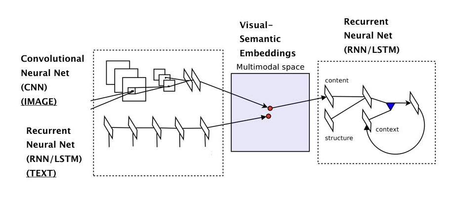
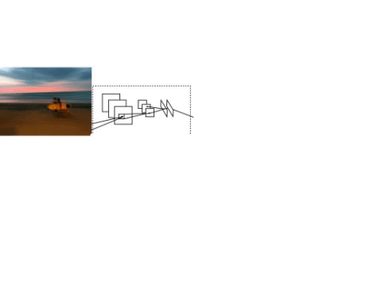
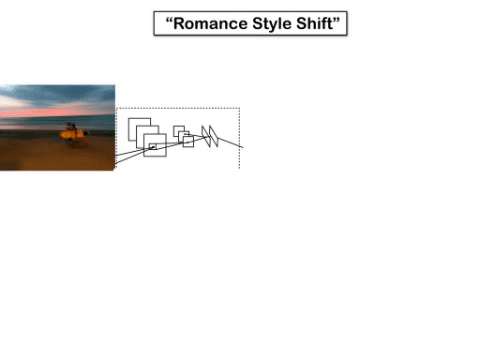

---

## Image to Captions (retrieve)


### /api/v1/image2caption

example curl call:

```curl -F 'image=@/Users/roelof/Downloads/5503072658_00e4af05ac_z.jpg' ec2-52-214-48-175.eu-west-1.compute.amazonaws.com:8787/api/v1/image2caption```

response:

```{"status": "ok", "response": "[\"BLURRED MOVEMENT OF TWO PEOPLE RUNNING ON THE BEACH HOLDING A SURF BOARD\", \"A yellow car travels down the road with a surf board on top .\", \"A man with a surfboard walking across the beach at sunset .\", \"Person on a beach watching a single-sail boat out past the surf at sunset .\", \"A person stands beside a surfboard on the beach just after sunrise\"]"}```

---

## Image to Story (generate)



### /api/v1/image2story

example curl call:

```curl -F 'image=@/Users/roelof/Downloads/5503072658_00e4af05ac_z.jpg' ec2-52-214-48-175.eu-west-1.compute.amazonaws.com:8787/api/v1/image2story```

response:

```{"status": "ok", "response": "A man wearing a beach house on the horizon ."}```

---

## Image to Romance (generate)


### /api/v1/image2romance

example curl call:

```curl -F 'image=@/Users/roelof/Downloads/5503072658_00e4af05ac_z.jpg' ec2-52-214-48-175.eu-west-1.compute.amazonaws.com:8787/api/v1/image2romance```

response:

```{"status": "ok", "response": "My descent was at the beach , and I closed my eyes for a moment . For the first time in years , I had no idea who he really wanted to be . The sun rose up on the horizon , making it appear as if she 'd fallen asleep on the beach . Her boyfriend had saved her life , and that was the most beautiful thing in the world . I didn t know what to do , so I let go of Alex s arm and pull him out of the water . The waves seemed to fade , leaving me at the conclusion I was beautiful ."}```

---

## Image to Regularities (pos/neg) (retrieve)



### /api/v1/image2reg

example curl call:

```curl -F 'pos=sea' -F 'neg=cloud' -F 'image=@/Users/roelof/Downloads/5503072658_00e4af05ac_z.jpg' ec2-52-214-48-175.eu-west-1.compute.amazonaws.com:8787/api/v1/image2reg```

response:

```{"status": "ok", "response": "[\"A person with a surf board in the sea\", \"a person is out at sea carrying a surf board\", \"There is a ocean and a individual carrying a surfboard .\", \"A shirtless man carrying a surfboard out of the water\", \"A motor boat moving fast in the sea\"]"}```
